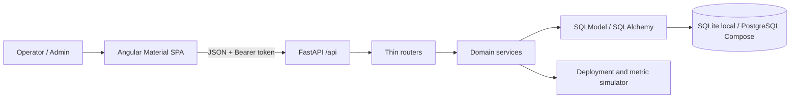
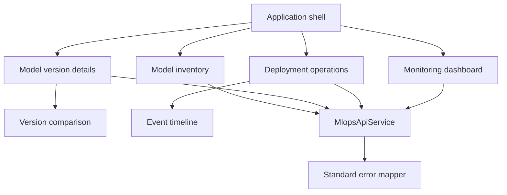
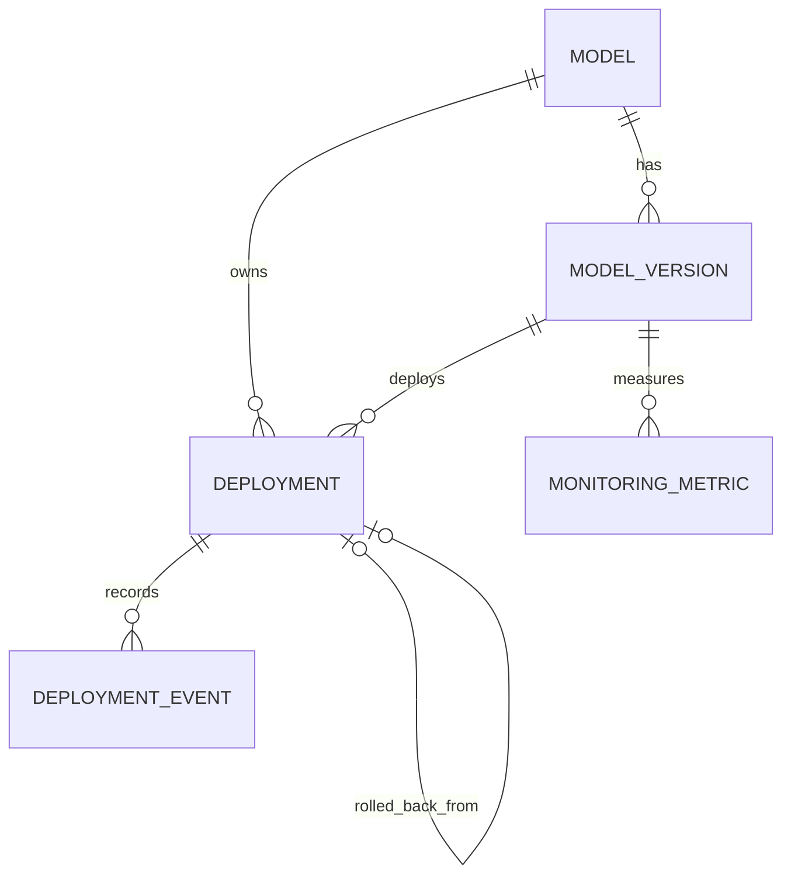
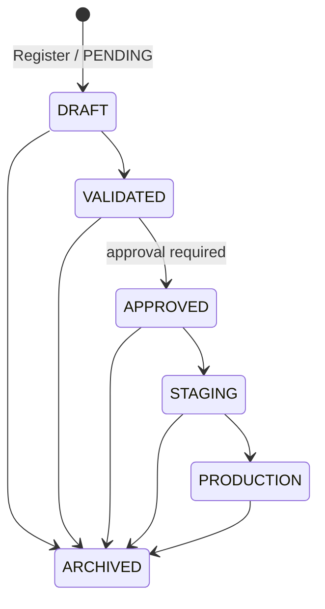
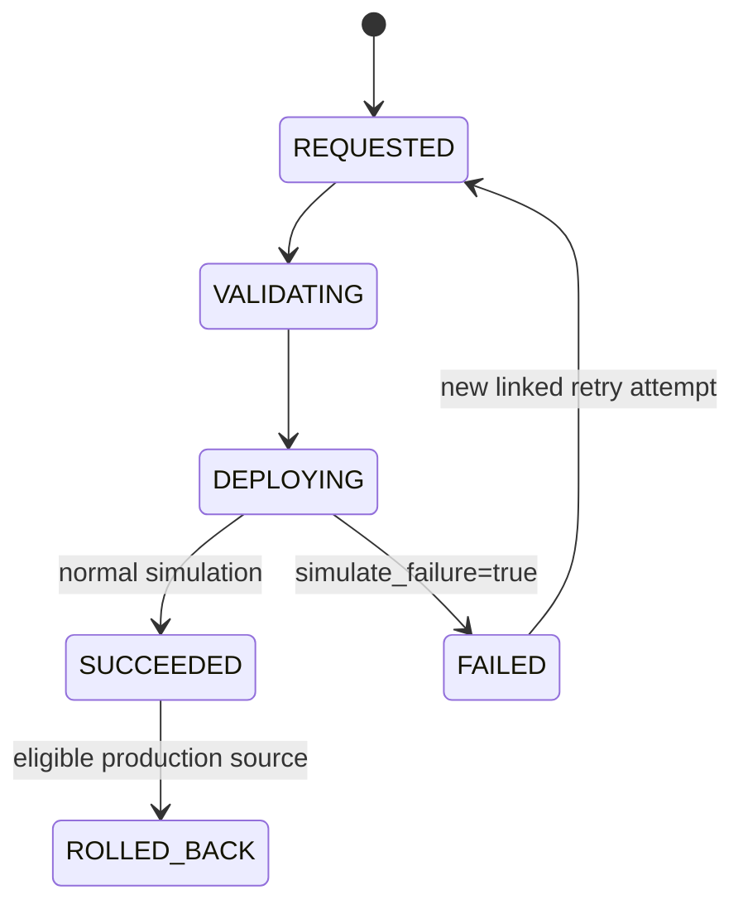

# MLOps Platform Architecture

## System overview

The platform is a time-boxed MLOps control plane. It registers logical models and versions, governs approval and lifecycle promotion, simulates deployments, records immutable deployment history, and displays representative operational metrics. It deliberately excludes model training, Kubernetes/cloud execution, and real telemetry integration.



The existing repository provides FastAPI, SQLModel/SQLAlchemy, Alembic, Pytest, an Angular standalone shell, JSON logging, `/api` router prefixes, and role-aware authentication. The target design retains them. Active users may read MLOps data and administrators perform mutations unless that policy is explicitly changed.

## Backend architecture

| Layer | Responsibility | Location |
|---|---|---|
| Routers | HTTP binding, dependencies, DTOs, status codes; no business transitions. | `backend/app/routers/` |
| Schemas | Pydantic request/response types, enums, input constraints. | `backend/app/schemas/` or incrementally separated from `models/mlops.py` |
| Services | Model/version rules, state transitions, idempotency, event creation, logging. | `backend/app/services/` |
| Repository | Complex query/data-access boundary when required. | `backend/app/repositories/` |
| Entities | SQLModel tables, constraints, indexes, audit timestamps. | `backend/app/models/` |
| Persistence | Session/configuration from environment variables and Alembic migrations. | `database.py`, `alembic/` |
| Cross-cutting | Correlation ID, structured errors/logs, CORS, health/OpenAPI. | `main.py`, `core/` |

**Service responsibilities**

- `ModelService`: unique models, model CRUD/read models, version registration.
- `VersionLifecycleService` (or expanded `ModelService`): approval actor/time and validated lifecycle transitions.
- `DeploymentService`: production approval guard, idempotency, synchronous simulator, event persistence, retry, rollback.
- `MonitoringService`: latest representative snapshot and deterministic status classification.
- `ComparisonService` (or `ModelService`): same-model validation and normalized version/metric comparison.

```mermaid
sequenceDiagram
	participant U as Angular UI
	participant R as Router
	participant S as Deployment service
	participant D as Database
	U->>R: POST /api/deployments + Idempotency-Key
	R->>S: create(payload, key, actor)
	S->>D: find by idempotency key
	alt duplicate
		D-->>S: existing deployment
		S-->>R: existing result (200)
	else new
		S->>D: validate version; create deployment
		S->>D: append REQUESTED, VALIDATING, DEPLOYING events
		S->>D: append SUCCEEDED or FAILED event
		S-->>R: created result (201)
	end
	R-->>U: resource or structured error with trace_id
```

All timestamps are UTC ISO-8601. Important mutations log the trace ID, actor, aggregate ID, action, and outcome.

## Frontend architecture

The Angular standalone application uses Angular Material, RxJS, typed API models, feature routes, and shared UI state components.



The shell supplies navigation, responsive layout, notification outlet, and existing authentication guard. The shared API layer sets authorization/idempotency headers, passes filters, and exposes parsed API errors. Reusable loading, empty, inline-error, and success states prevent false success indications. Feature pages own their forms and reload data only after operations succeed.

## Database design



| Entity | Target responsibility and fields |
|---|---|
| `models` | Logical model; unique `name`, description, tags, metadata, `created_at`, `updated_at`. |
| `model_versions` | `model_id`, unique human version per model, description, tags/metadata, framework/algorithm, artifact/training references, approval status/by/at, lifecycle stage, audit times. |
| `deployments` | `model_id`, `model_version_id`, environment, status, unique idempotency key, simulate flag, requested/started/completed times, failure reason, retry/rollback links, audit times. |
| `deployment_events` | deployment ID, old/new status, event type, message, actor, creation time; append-only. |
| `monitoring_metrics` | model/version IDs, seven required metrics/status fields, inference time, `measured_at`. |

Constraints: unique model name; unique `(model_id, version)`; unique deployment idempotency key; foreign keys; indexes by model/version/environment/status/time and event/metric lookup keys. SQLite remains local default; PostgreSQL is used by Compose; all schema changes use Alembic.

## Model lifecycle

New versions always begin `PENDING` and `DRAFT`; approval and deployment are distinct.



Allowed transitions are `DRAFT -> VALIDATED|ARCHIVED`, `VALIDATED -> APPROVED|ARCHIVED`, `APPROVED -> STAGING|ARCHIVED`, `STAGING -> PRODUCTION|ARCHIVED`, and `PRODUCTION -> ARCHIVED`. Transition to `APPROVED` requires approval status `APPROVED`; invalid transitions return `409`.

## Deployment state flow



Every state transition produces one immutable event. Retry creates a distinct deployment linked by `retry_of_deployment_id`; it never overwrites the failed attempt. Rollback is allowed only for a successful production deployment with an immediately preceding successful production deployment for the same model/environment. It creates a linked rollback deployment targeting the prior version and marks the source `ROLLED_BACK`.

## Monitoring data approach

Metrics are representative/demo data, generated deterministically or seeded per model version, optionally when a deployment succeeds. The README and dashboard explicitly label them **representative/demo monitoring data, not live production telemetry**. The latest snapshot exposes latency, throughput, error rate, quality, drift, availability, last successful inference, measured time, and a threshold-derived `HEALTHY`, `WARNING`, `CRITICAL`, or `UNKNOWN` status.

## Key business rules

1. Model names are unique; version identifiers are unique only within their model.
2. Only approved versions may deploy to `PRODUCTION`; environments are `DEV`, `TEST`, `STAGING`, `PRODUCTION`.
3. An `Idempotency-Key` is mandatory. A duplicate returns the original deployment and creates no new event.
4. Simulated failure ends as `FAILED`; only `FAILED` may be retried.
5. Only eligible successful production deployments may be rolled back.
6. Comparing versions from different models is rejected.
7. Invalid input is `422`, absent resources `404`, and conflicts/invalid state `409`, all in the standard error envelope.

## Assumptions and limitations

- Resource IDs are UUIDs; human version values are strings such as `1.0.0` without initial semantic-version enforcement.
- The authenticated user is the approver/event actor; simulator actions use `system`.
- Deployment simulation completes in-request for deterministic tests; a worker can later preserve the same event contract.
- No real training, artifact validation, cloud/Kubernetes/MLflow delivery, live telemetry, advanced authorization, or telemetry trends is included.
- SQLite has different concurrency characteristics from PostgreSQL; the database unique constraint is the final idempotency guard.